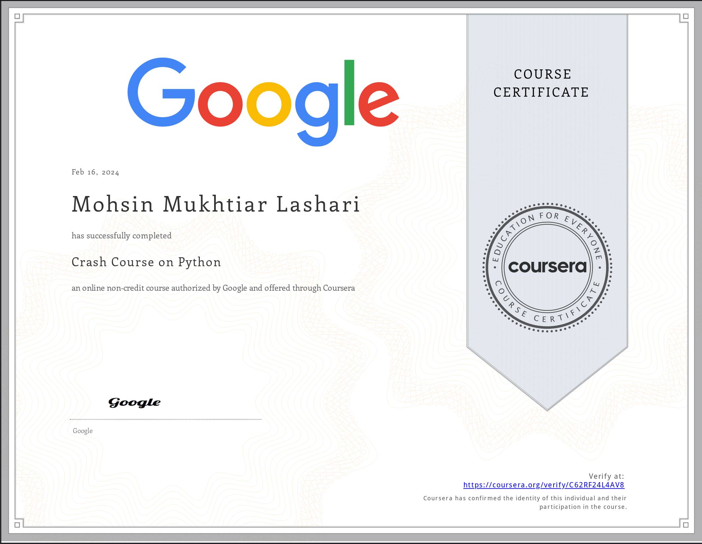
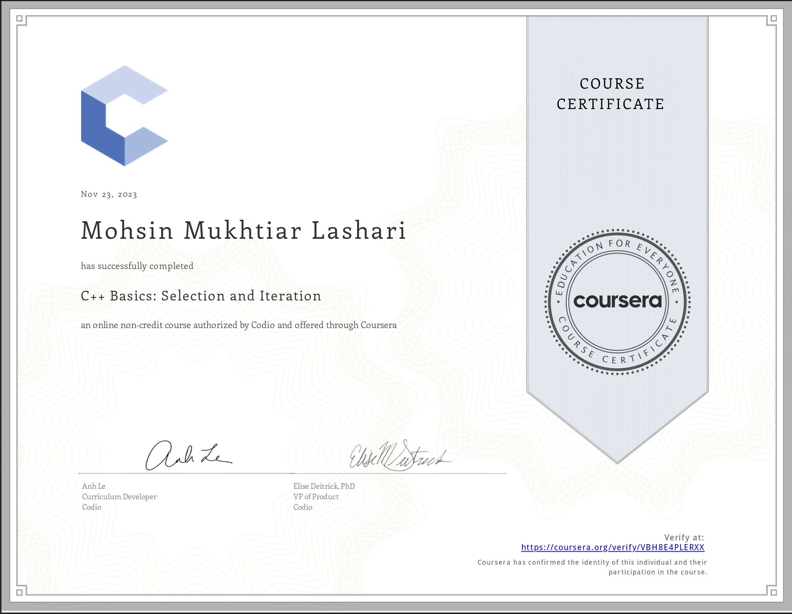
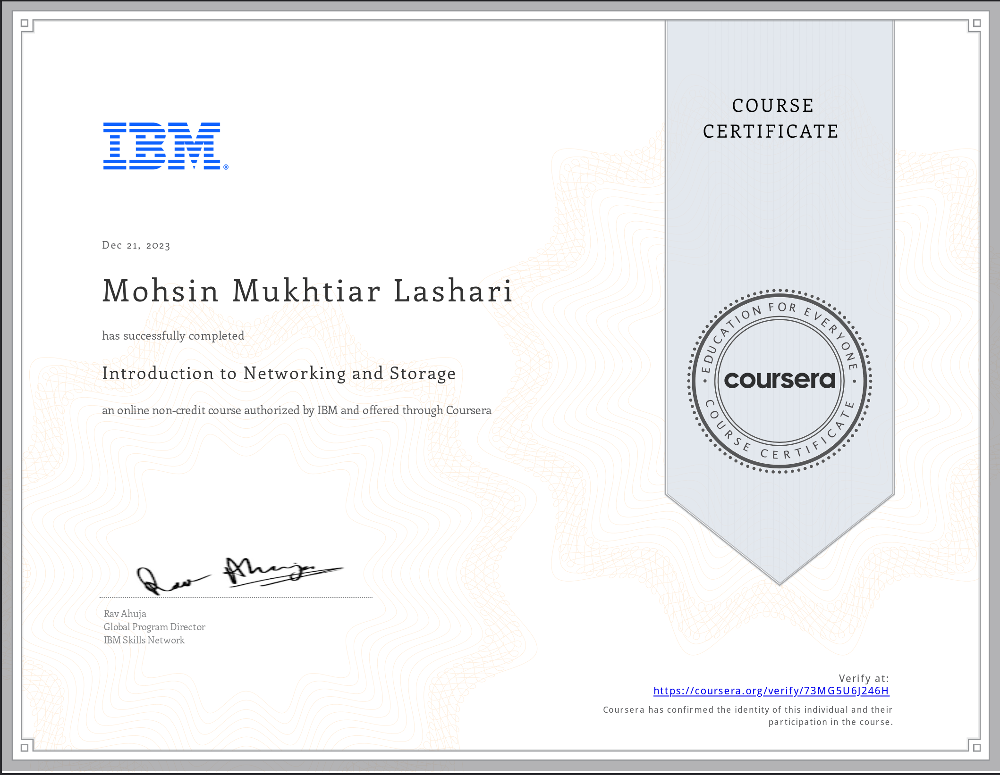
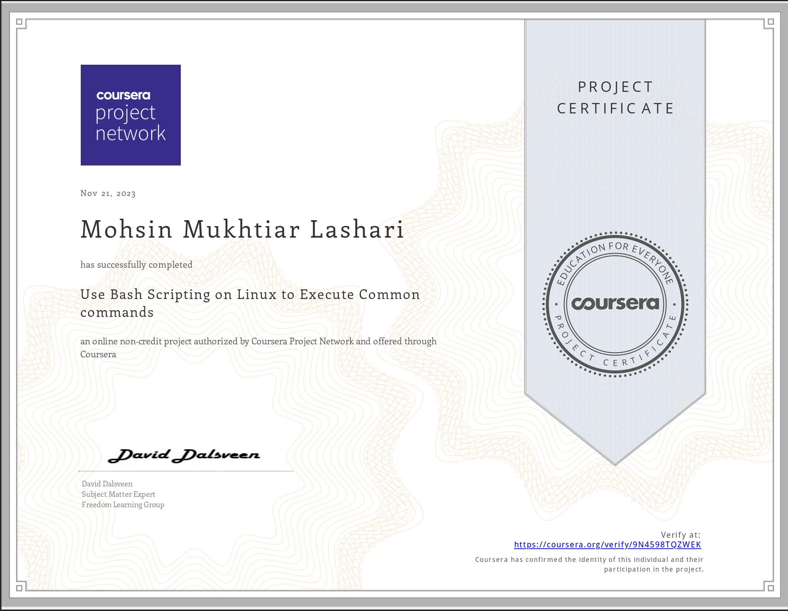

<h1 align="center">Hi 👋, It's Mohsin</h1>
<h4 align="center">A Cyber Security Enthusiast, Privilege Escalator, CTF Player</h4>
  <h3>Certifications</h3>
  

    
    
    
    
    
    

<h3>TryHackMe</h3>
    

  <h2>My Contributions</h2>
   
  
  
     

<h2 align="center">⚡ Stats</h2>
 

   
  

